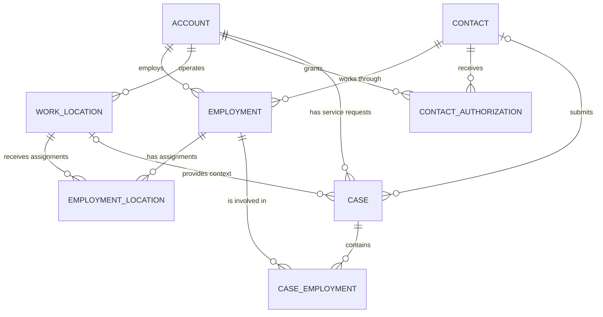

# Aloha Workforce Solutions — Core Salesforce Data Model

> **Living ERD**
>
> This document evolves with the architecture. The business story explains
> why the model exists; the ERD records how the entities relate.

---

## Business Story

Aloha Workforce Solutions provides HR and workforce services to employers.

An **Account** represents an employer, such as Koa Surf & Hospitality LLC.

A **Contact** represents a person. A person may be an employee, an employer
administrator, or both.

An **Employment** represents a person's employment relationship with a
specific employer.

For example:

> Kai Nakamura works for Koa Surf & Hospitality.

That fact belongs to Employment, not Contact.

An employer may operate multiple **Work Locations**.

An **Employment Location** records where an Employment was assigned and when.
Because assignments can change over time, this is an effective-dated
relationship rather than simply storing a current location on Employment.

A **Contact Authorization** records what a Contact is authorized to do for an
Account and during what effective period.

For example:

> Malia Kealoha is authorized to perform Payroll actions for Koa during 2026.

Authorization is therefore a fact about the relationship between the person
and employer, not simply an attribute of Contact.

A standard Salesforce **Case** represents a Service Request.

The Case identifies:

- the employer associated with the request,
- the person who submitted it,
- the Work Location when the issue is location-specific,
- and the service issue itself.

When a Service Request affects employees, it relates to **Employment**, not
directly to Contact.

This matters because the business issue concerns a person's employment with a
particular employer, not simply the person's identity.

One Case can involve many Employments, and one Employment can appear in many
Cases over time.

**Case Employment** represents that many-to-many relationship.

Case Employment also stores facts about an Employment's involvement in that
specific Service Request, such as its current investigation status and
resolution information.

---

## Core ERD



---

## Relationship Map

```text
Account (Employer)
│
├── Employment ───────────── Contact (Person)
│      │
│      └── Employment Location ─── Work Location
│
├── Work Location
│
├── Contact Authorization ── Contact
│
└── Case (Service Request)
       │
       ├── Contact = Requester
       ├── Work Location = Optional context
       │
       └── Case Employment
              │
              └── Employment = Affected employment
```

---

## Relationship Design

### Account → Employment

**Required Lookup + Restrict**

Employment has its own lifecycle, but every Employment must identify an
Employer.

### Contact → Employment

**Required Lookup + Restrict**

Contact represents the person. Employment represents that person's
relationship with an employer.

Deleting the person should not silently erase employment history.

### Account → Work Location

**Required Lookup + Restrict**

A Work Location belongs to an employer but maintains an independent lifecycle.

### Employment → Employment Location

**Master-Detail**

An Employment Location assignment has no business meaning without its
Employment.

### Work Location → Employment Location

**Required Lookup + Restrict**

Deleting a Work Location should not silently erase historical assignment
records.

### Contact / Account → Contact Authorization

**Required Lookup + Restrict**

Authorization is an auditable relationship fact and should preserve its
business history.

### Account → Case

Standard Salesforce `Case.AccountId`.

This identifies the employer associated with the Service Request.

### Contact → Case

Standard Salesforce `Case.ContactId`.

This answers:

> Who submitted the Service Request?

It does not answer:

> Was that person authorized?

Authorization remains a separate concern represented by
`Contact_Authorization__c`.

### Work Location → Case

**Optional Lookup + Restrict**

Some Service Requests are location-specific; others are not.

Deleting a Work Location should not damage historical Service Request records.

### Case → Case Employment

**Master-Detail**

A Case Employment record has no business meaning without its Service Request.

The Case controls the lifecycle and sharing of the relationship record.

### Employment → Case Employment

**Required Lookup + Restrict**

Employment has an independent lifecycle.

Deleting Employment should not silently remove its historical involvement in
Service Requests.

---

## Case Employment Lifecycle

`Case_Employment__c.Status__c` represents the current determination:

1. **Suspected** — default
2. **Confirmed Affected**
3. **Not Affected**
4. **Resolved**

`Resolution_Notes__c` is required when the status becomes:

- Not Affected
- Resolved

Field History Tracking is enabled for `Status__c`.

This preserves changes such as:

```text
Suspected
    ↓
Confirmed Affected
    ↓
Resolved
```

without requiring separate fields for every possible status transition.

> **Current state belongs in the record.  
> State transitions belong in history.  
> Explanation belongs in the relationship when the relationship itself changes meaning.**

---
## Employment Change Processing

A Service Request can have at most one `Employment_Change_Request__c`.

The Employment Change Request represents the overall change package for an
affected Employment. Each `Employment_Change_Item__c` represents one atomic
change within that package.

```text
Case (Service Request)
        |
        | 0..1
        v
Employment Change Request
        |
        | 1..*
        v
Employment Change Item
```

This allows one business transaction to contain multiple independently
processable changes.

For example:

```text
Employment Change Request
    |
    +-- Job Title
    +-- Department
    +-- Work Location
```

The Employment Change Item is the atomic Payroll decision unit. Individual
items in the same request can therefore be Approved, Modified, or Rejected
independently.

The processing architecture preserves three distinct stages:

```text
Requested
    |
    v
Payroll Authorized
    |
    v
Implemented
```

The parent Employment Change Request aggregates the processing state and
outcome of its child items.

Detailed lifecycle, Payroll processing, cancellation, Flow design, and
acceptance-test evidence are documented in
[Employment Change Processing Architecture](../employment-change-processing.md).

---
## Architecture Mental Models

### Business story first

Do not memorize the entire ERD.

Remember the story:

> **Employer → People → Employment → Locations → Assignments**  
> **People → Employer Authorizations**  
> **Employer → Service Requests → Affected Employments**

The ERD remembers the implementation details.

### Where does the fact belong?

Ask:

> **What business entity or relationship does this fact actually describe?**

Examples:

- Case Open Date → Case
- Employee Number → Employment
- Authorization Type → Contact Authorization
- Assignment Start Date → Employment Location
- Employment's Service Request status → Case Employment

### Choosing the relationship type

Ask:

1. Does the child have meaning without the parent?
2. Should deleting the parent automatically delete the child?
3. Is the relationship historical or auditable?
4. Is this many-to-many?
5. Does the relationship itself have facts?

Mental shortcuts:

> **Master-Detail:** delete the parent and the child goes with it.

> **Lookup + Restrict:** protect the referenced record when history depends on it.

> **Many-to-many:** usually introduces a junction object.

> **If the junction only connects, keep it lean. If the relationship starts
> telling a story, give it fields.**

---

## Guiding Architecture Principle

> **Requirements introduce technology. Technology is not forced into
> requirements. Complexity must be earned.**

This model should evolve only when a business requirement justifies additional
objects, relationships, fields, automation, or platform capabilities.

---

## Implementation Status

| Component | Status |
|---|---|
| Employment | Built and tested |
| Work Location | Built and tested |
| Employment Location | Built and temporal behavior tested |
| Contact Authorization | Built and behavior tested |
| Case Work Location | Built and deployed |
| Case Employment | Built and deployed |
| Case Employment default status | Behavior tested |
| Resolution validation | Behavior tested |
| Status Field History Tracking | Behavior tested |

